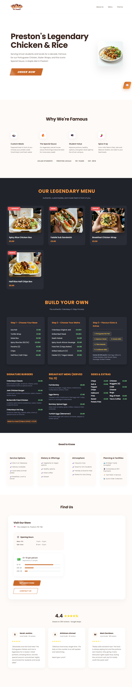

# 🤖 AI Chatbot Website

<p align="center">
  <b>Modern AI Chatbot with Clean UI & Smooth Interaction</b><br>
  Fast • Responsive • Privacy-Friendly
</p>

<p align="center">
  
  
  
</p>

---

## 🚀 Live Demo

🔗 https://marvelous-biscochitos-0102a9.netlify.app/

---

## 📸 Preview

### 🖥️ Desktop Experience

<p align="center">
  
</p>

### 📱 Mobile Experience

<p align="center">
  
</p>

## ✨ Features

* 💬 Real-time chatbot interaction
* 🎨 Clean and modern UI
* ⚡ Lightweight and fast
* 🔒 No microphone (privacy-focused)
* 📱 Fully responsive design

---

## 🧠 Tech Stack

<p align="center">
  
</p>

---

## 📂 Project Structure

```
chatbot-ai-website/
├── index.html
├── style.css
├── script.js
├── assets/
│   ├── desktop.png
│   └── mobile.png
```

---

## ▶️ Getting Started

```bash
git clone https://github.com/your-username/your-repo.git
cd chatbot-ai-website
```

Open `index.html` in your browser.

---

## 🔄 Updates

* ❌ Removed microphone feature
* ✨ Improved UI and layout
* 🧹 Cleaned and optimized code

---

## 🔮 Future Plans

* 🤖 AI API integration
* 💾 Chat history
* 🌙 Dark mode
* 🎤 Optional voice toggle

---

## 🔒 License

This project is private and not licensed for public use.

---

## 👨‍💻 Author

**Your Name**
